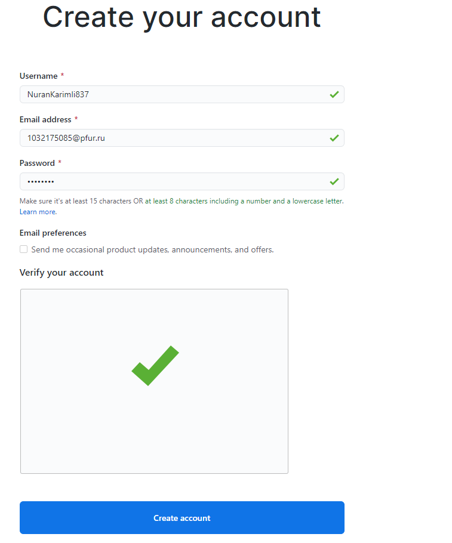
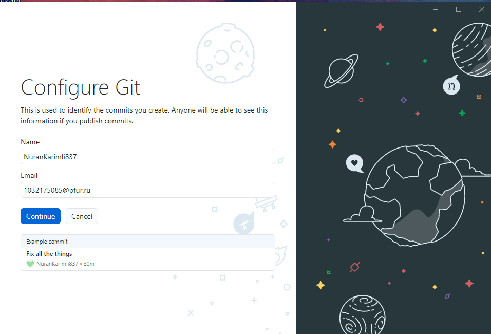
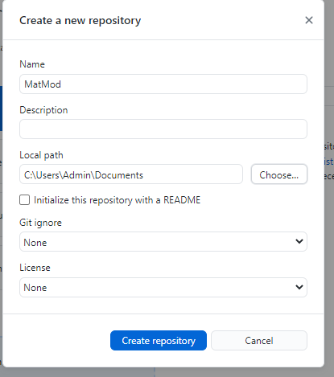
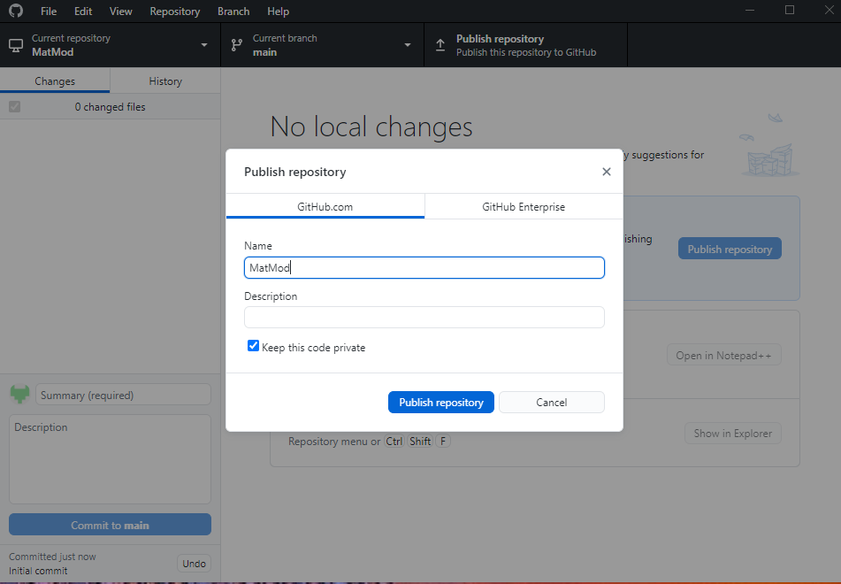
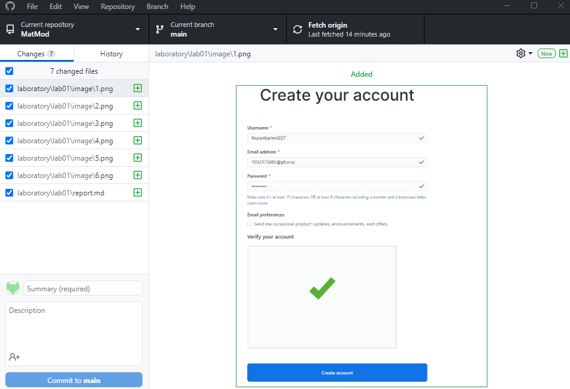
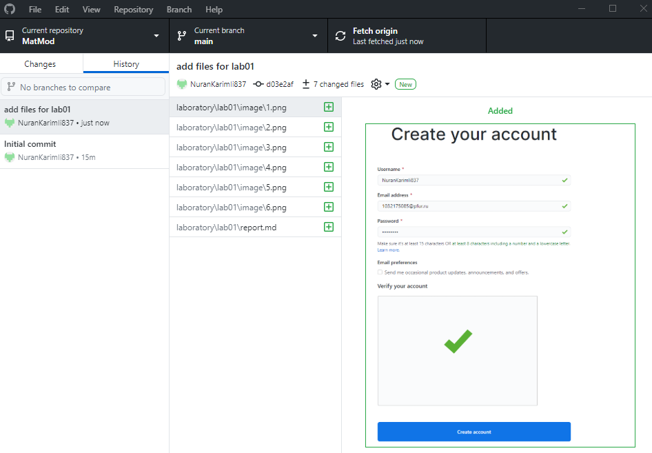

---
## Front matter
lang: ru-RU
title: Создание репозитория на GitHub
author: |
	 Каримли Нуран, НКНбд-01-18,\inst{1}

institute: |
	\inst{1}Российский Университет Дружбы Народов

date: МатМод--2021, 13 февраля, 2021, Москва, Россия

## Formatting
mainfont: PT Serif
romanfont: PT Serif
sansfont: PT Sans
monofont: PT Mono
toc: false
slide_level: 2
theme: metropolis
header-includes: 
 - \metroset{progressbar=frametitle,sectionpage=progressbar,numbering=fraction}
 - '\makeatletter'
 - '\beamer@ignorenonframefalse'
 - '\makeatother'
aspectratio: 43
section-titles: true

---

# Цели и задачи работы

## Цель лабораторной работы

Ознакомиться с Git, создать репозиторий для хранения лабораторных работ

## Задание к лабораторной работе

1. Установить Git
2. Создать аккаунт на GitHub
3. Создать репозиторий для хранения лабораторных работ

# Процесс выполнения лабораторной работы

## Регистрация на Git 
{ #fig:001 width=70% height=70% }

## Установка GitHub Desktop

{ #fig:002 width=70% height=70% }

{ #fig:003 width=70% height=70% }

{ #fig:004 width=70% height=70% }

## Создание репозитория

{ #fig:005 width=70% height=70% }

{ #fig:006 width=70% height=70% }

## Загрузка файлов

{ #fig:007 width=70% height=70% }

## Итог

{ #fig:008 width=70% height=70% }

# Выводы по проделанной работе

## Вывод

Создан репозиторий для хранения лабораторных работ на GitHub
